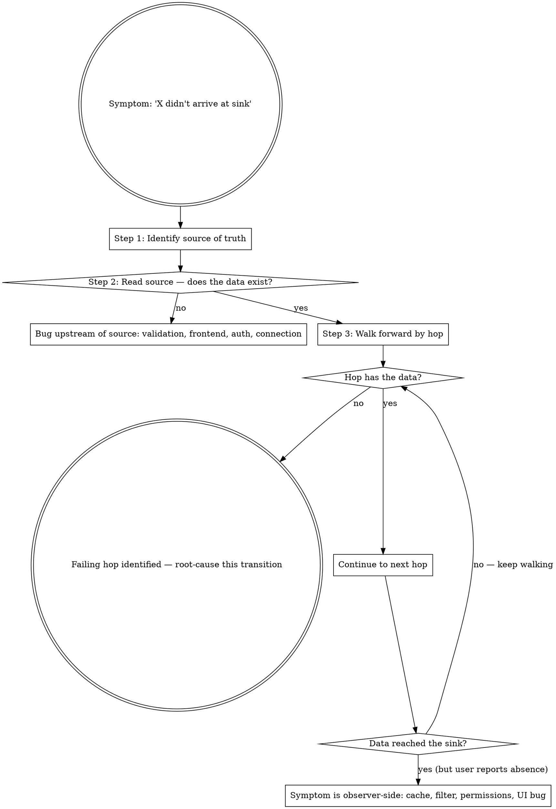

# Debug Source-First

## Overview

When a downstream symptom is "X didn't arrive / didn't appear", the natural instinct is to investigate where the user is looking (the email client, the dashboard, the report). That's usually wrong — or at best, the slowest path.

**Core principle:** Start at the source of truth. Bisect forward through the pipeline. Stop at the last hop where the data exists and the first one where it's missing.

**Two roles, not merged:** this skill is the **first-step rule** — it answers *where* the data is lost or goes wrong, by locating the failing transition. `diagnosing-bugs` is the **diagnosis engine** — it answers *why* that transition fails, with its six phases. Run this one first, then hand the transition over; don't diagnose a hop you haven't localized, and don't bisect again once you have.

## The Iron Law

```
SOURCE OF TRUTH FIRST. BISECT FORWARD. ONLY ROOT-CAUSE THE FAILING HOP.
```

If you haven't read the source of truth, you haven't started debugging — you're guessing.

## When to Apply

The symptom is an **absence** at a downstream observation point:
- "The email didn't arrive."
- "The order doesn't appear in the dashboard."
- "My report is empty / missing rows."
- "The webhook never fired."
- "Nothing got synced to the partner system."
- "I don't see it in our CRM / data warehouse / analytics."

**Extension — same algorithm for wrong values in a pipeline:** when the symptom is "the value at the sink is incorrect" (truncated, transformed wrong, partial) AND the data crosses multiple hops, the same bisect-forward applies — at each hop, check *"is the value correct here?"* instead of *"is it present here?"*. The first hop where the value diverges from the source is the failing transition.

Pipelines this covers:
- DB → ETL → connector → dashboard
- API → queue → worker → external sink
- Frontend POST → backend → broker → email service → recipient
- Form submission → validation → persistence → notification

## When NOT to Apply

- Symptom is an **error message** with a stack trace → use `diagnosing-bugs` directly.
- Single-process bugs without hops (one component does everything; nothing to bisect).
- You already know which hop is failing → root-cause that hop directly.
- The "wrong value" is purely cosmetic / formatting (timezone display, currency symbol) and you already have the raw correct value in hand — that's a UI bug, not a pipeline bug.

## The Algorithm



### Step-by-step

**1. Identify the source of truth.** Where does this data originate? The first persisted location *you* own and *can read*. Examples:
   - Transactional DB (Postgres, MySQL) for app records.
   - Inbound webhook log for partner events.
   - Append-only event log for streaming.
   - Auth/identity provider for sessions.

**2. Read the source.**
   - **Not there?** The bug is upstream of persistence. Investigate frontend/validation/auth/connection — but *now you know* you're not chasing a downstream ghost.
   - **There?** Continue to step 3.

**3. Walk forward by hop.** Each hop = one transition (DB → connector → consumer). At each hop, ask: *does the data exist here?* — or, for wrong-value bugs: *does the value at this hop match the source?* Use the read mechanism appropriate for the hop (SQL, query on the destination table, queue inspection, run-state API, log grep).

**4. Identify the boundary.** The hop where data is present, and the next one where it's absent, **is the failing transition**. Now you've localized the problem to one edge.

**5. Root-cause THAT transition.** Now switch to `diagnosing-bugs` and run its Phase 1 against the failing transition alone. You've eliminated all the other hops.

## Mechanisms for "Read the Source / Hop"

| Hop type | How to inspect |
|----------|---------------|
| Transactional DB | `SELECT … WHERE id = X` (by primary key, not list-scan — see `verify-downstream-arrival` for the truncation trap). |
| Inbound webhook | Webhook delivery log on your side; check raw body persisted. |
| Message queue / broker | Peek the queue by ID; consumer offset. |
| Stream / connector | The last run's inserted-row count + a read by ID in the destination table. |
| ETL job / materialized view | Read row + check `updated_at >= source.updated_at`. |
| External API call | Outbound log on your side; partner's inbound log if accessible. |
| Email / notification | Delivery log (not just SMTP 250). |
| UI / dashboard | Direct DB read first; the UI being wrong is a separate (observer-side) class. |

## Worked Example

> User reports: "I submitted the order at 10:14am, the manager never got the approval email."

Wrong path (what you might do without this skill):
- Investigate email service config → 30 minutes.
- Investigate workflow trigger → 20 minutes.
- Investigate the recipient's spam filter → 15 minutes.
- Eventually check the DB → "oh, the order was never created because the form validation rejected the phone number".

Right path (source-first):
1. Source of truth: transactional DB. `SELECT * FROM orders WHERE submitted_at >= '10:00';` → 0 rows.
2. Bug is upstream of persistence — frontend submitted but didn't reach the DB.
3. Check frontend submit log → 400 from backend → check backend validation → phone number regex.
4. Fix the regex. Total time: 5 minutes.

Same conclusion. 1/15 of the time.

## Worked Example — wrong value

> User reports: "The invoice total in the monthly report shows 1000, but the customer paid 1000.50."

1. Source of truth: `SELECT total FROM invoices WHERE id = 4711;` → `1000.50`. The value is right at the source.
2. Next hop, the nightly ETL output: `1000.50`. Still right.
3. Next hop, the reporting view the report reads: `1000`. Wrong.
4. The failing transition is ETL output → reporting view. Hand exactly that edge to `diagnosing-bugs` (here, a column cast to an integer type) — not the report, not the ETL.

## Anti-Patterns — STOP

- Investigating the symptom layer (email service, dashboard, partner system) before reading your own DB.
- Asking the user "did you check spam / browser cache / try again" before checking the source.
- Assuming "the system is working" because each component looks healthy in isolation; the bug is in a hop, not a component.
- Reading the sink, finding the data, and reporting "everything works" — the user said they don't see it. The hop from sink to observer (cache, permissions, UI filter, timezone) is also a hop.
- Skipping a hop because "we just deployed that, it can't be broken." That's exactly when it can be.
- Walking forward without confirming source — you're guessing the data made it past step 1.

## Rationalization Prevention

| Excuse | Reality |
|--------|---------|
| "Last time it was the email service" | Last time isn't this time. Check the source first — it's cheap. |
| "The DB is healthy, must be downstream" | DB health ≠ this record exists. Read by ID. |
| "Production hasn't changed, must be a flake" | Pipelines have async state. Re-verify before dismissing. |
| "User said it didn't arrive, I trust them" | Trust the report. Don't trust your assumption about *which* hop. |
| "Investigating the source takes too long" | A SELECT by primary key takes 2 seconds. Faster than checking three downstream services. |
| "The hop I'd check is hardest, skip it" | The hop you're avoiding is statistically where the bug lives. |

## Red Flags — STOP

- About to investigate the symptom layer without having read the source.
- 30+ minutes into a downstream-bug investigation without a single `SELECT … WHERE id = X`.
- Multiple components "look fine" but the user still reports absence — you haven't walked the hops, you've spot-checked.
- About to ask the user to retry / refresh / clear cache without source-side evidence first.

## The Bottom Line

The user observes the sink. You own the source. Start where you have evidence — not where you have to ask the user for it.

Read the source. Walk forward. Localize the failing hop. *Then* hand it to `diagnosing-bugs` to root-cause.
